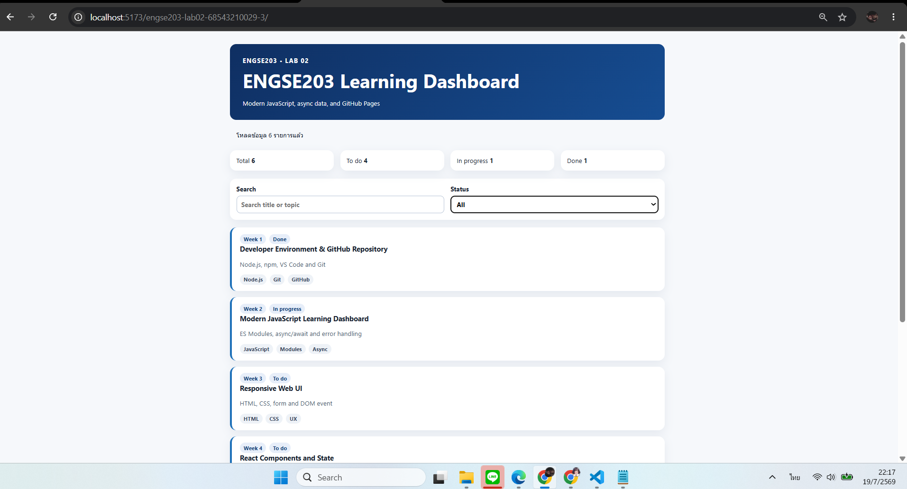
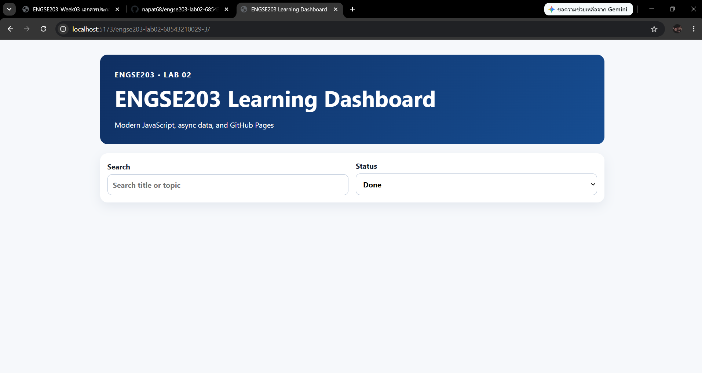

# 🚀 ENGSE203 LAB02 — JavaScript Dashboard

## 👩‍💻 ผู้จัดทำ

- **ชื่อ-นามสกุล:** นางสาวนภัสประภา กุลสุทธิเสถียร
- **รหัสนักศึกษา:** 68543210029-3
- **ระบบปฏิบัติการที่ใช้พัฒนา:** macOS / Windows
- **Repository:** `engse203-lab02-68543210029-3`

---

## 🎯 วัตถุประสงค์

โปรเจกต์นี้เป็นส่วนหนึ่งของ Lab 02 รายวิชา **ENGSE203 (Modern JavaScript)** มีวัตถุประสงค์เพื่อฝึกพัฒนาเว็บ Dashboard ด้วย JavaScript สมัยใหม่ โดยนำแนวคิด **ES Modules** มาใช้แบ่งหน้าที่ของโปรแกรมออกเป็นโมดูลย่อย

การแยกโค้ดออกเป็นหลายโมดูลช่วยให้โครงสร้างของโปรแกรมมีความชัดเจน อ่านและตรวจสอบได้ง่าย รวมถึงสามารถนำฟังก์ชันบางส่วนกลับมาใช้ซ้ำ และแก้ไขเพิ่มเติมได้อย่างสะดวกในอนาคต

Dashboard รองรับการแสดงผลข้อมูลใน 2 รูปแบบ ได้แก่

- ✅ **Normal State** — ระบบสามารถดึงและแสดงข้อมูลได้ตามปกติ
- ❌ **Error State** — ระบบไม่สามารถดึงข้อมูลได้และแสดงข้อความแจ้งเตือน

นอกจากนี้ยังมีการตรวจสอบคุณภาพโค้ด สร้างไฟล์สำหรับใช้งานจริง และเผยแพร่ผ่าน **GitHub Pages**

---

## 🧩 โครงสร้างโมดูล

| ลำดับ | Module | หน้าที่ของโมดูล |
|---:|---|---|
| 1 | `api.js` | ติดต่อและดึงข้อมูลจากไฟล์ `data/learning-tasks.json` ผ่านฟังก์ชัน `fetchLearningTasks()` ตรวจสอบ HTTP status และความถูกต้องของข้อมูล รวมถึงรองรับการจำลองข้อผิดพลาดด้วย `simulateError` |
| 2 | `main.js` | เป็นจุดเริ่มต้นของแอปพลิเคชัน ทำหน้าที่ควบคุม state จัดการ event listeners สำหรับการค้นหาและกรองข้อมูล เรียกใช้โมดูลอื่น และจัดการข้อผิดพลาดด้วย `try/catch` |
| 3 | `ui.js` | จัดการการแสดงผลส่วนติดต่อผู้ใช้งาน เช่น `renderStats()`, `renderTasks()` และ `setMessage()` พร้อมป้องกัน XSS ด้วยฟังก์ชัน `escapeHtml()` |
| 4 | `utils.js` | รวบรวมฟังก์ชันช่วยเหลือ เช่น การกรองข้อมูลด้วย `filterTasks()` การคำนวณสถิติด้วย `getStats()` และการแปลงชื่อสถานะด้วย `getStatusLabel()` |

---

## ⚙️ วิธีติดตั้งและรันโปรเจกต์

### 📌 ข้อกำหนดเบื้องต้น

ตรวจสอบเวอร์ชันของ Node.js และ npm ด้วยคำสั่งต่อไปนี้

```bash
node -v
npm -v
```

### 🍎 ขั้นตอนการติดตั้ง Node.js ผ่าน NVM

```bash
curl -o- https://raw.githubusercontent.com/nvm-sh/nvm/v0.40.5/install.sh | bash

source ~/.zshrc

command -v nvm

nvm install 22
nvm alias default 22
nvm use 22
```

### 📥 ขั้นตอนการดาวน์โหลดและติดตั้ง

```bash
# 1. Clone repository
git clone https://github.com/napat68/engse203-lab02-68543210029-3.git
cd engse203-lab02-68543210029-3

# 2. ติดตั้ง npm
npm init -y
npm install
```

### ▶️ รันโปรเจกต์

```bash
npm run dev
```

หลังจากรันคำสั่งแล้ว ให้เปิด URL ที่ปรากฏใน Terminal ผ่านเว็บเบราว์เซอร์ เช่น

```text
http://localhost:5173/engse203-lab02-68543210029-3/
```

เมื่อต้องการหยุด Development Server ให้กด

```text
Ctrl + C
```

---

## 📁 โครงสร้างไฟล์

```text
.
engse203-lab02-68543210029-3/
├── public/
│   ├── .nojekyll
│   └── data/
│       └── learning-tasks.json
├── scripts/
│   └── check-project.mjs
├── src/
│   ├── api.js
│   ├── main.js
│   ├── style.css
│   ├── ui.js
│   └── utils.js
├── docs/                       
├── .gitignore
├── index.html
├── package.json
├── README.md
└── vite.config.js
```

---

## 🛠️ คำสั่งที่ใช้งาน

| คำสั่ง | รายละเอียด |
|---|---|
| `npm install` | ติดตั้ง dependencies ที่จำเป็นทั้งหมดของโปรเจกต์ |
| `npm run dev` | เปิด Development Server สำหรับพัฒนาและทดสอบระบบ พร้อมรองรับ Hot Reload |
| `npm run check` | ตรวจสอบโครงสร้างและความถูกต้องของโค้ดในโปรเจกต์ |
| `npm run build` | สร้างไฟล์สำหรับใช้งานจริง และนำผลลัพธ์ไปเก็บไว้ในโฟลเดอร์ `docs/` |

หลังจากใช้คำสั่ง `npm run dev` ให้เปิดเว็บเบราว์เซอร์ไปยัง URL ที่แสดงใน Terminal เช่น `http://localhost:5173`

---

## 🌐 GitHub Pages URL

Dashboard ที่เผยแพร่ผ่าน GitHub Pages:

https://napat68.github.io/engse203-lab02-68543210029-3/

---

## 🖼️ ภาพการแสดงผล

<h3 style="color: green;">Normal</h3>

หน้าจอ Normal State แสดงผลเมื่อระบบสามารถโหลดข้อมูลได้สำเร็จ โดยผู้ใช้งานสามารถดูสถิติ ค้นหารายการ และกรองข้อมูลตามสถานะได้ตามปกติ



> **คำอธิบาย:** หน้าจอ Dashboard ในสถานะปกติ หลังจากระบบดึงข้อมูลและแสดงรายการทั้งหมดเรียบร้อยแล้ว  
>

---

<h3 style="color: red;">Error</h3>

หน้าจอ Error State แสดงผลเมื่อระบบไม่สามารถโหลดข้อมูลได้ เช่น เกิดข้อผิดพลาดจากแหล่งข้อมูลหรือการเชื่อมต่อเครือข่าย ระบบจะแสดงข้อความแจ้งเตือนแทนรายการข้อมูล



> **คำอธิบาย:** หน้าจอ Dashboard เมื่อจำลองเหตุการณ์ที่ระบบไม่สามารถดึงข้อมูลได้  
>

---

## 🧯 ปัญหาที่พบและวิธีแก้ไข

| ปัญหาที่พบ | สาเหตุ | วิธีแก้ไข |
|---|---|---|
| `git` ไม่สามารถใช้งานใน PowerShell ได้ | เครื่องยังไม่ได้ติดตั้ง Git หรือ Git ยังไม่ได้ถูกเพิ่มลงใน PATH | ติดตั้ง Git for Windows เลือกตัวเลือกให้สามารถใช้งาน Git ผ่าน Command Prompt, PowerShell และโปรแกรมอื่นได้ จากนั้นปิดและเปิด VS Code ใหม่ |
| `npm` ไม่สามารถใช้งานได้ | เครื่องยังไม่ได้ติดตั้ง Node.js หรือระบบยังไม่รู้จักตำแหน่งของ npm | ติดตั้ง Node.js รุ่น LTS แล้วปิดและเปิด VS Code ใหม่ จากนั้นตรวจสอบด้วย `node -v` และ `npm -v` |
| PowerShell แจ้งว่า `running scripts is disabled on this system` | Execution Policy ของ PowerShell ป้องกันการเรียกใช้ไฟล์ `npm.ps1` | ใช้คำสั่ง `Set-ExecutionPolicy -Scope CurrentUser RemoteSigned` แล้วตอบ `Y` เพื่ออนุญาตเฉพาะบัญชีผู้ใช้งานปัจจุบัน |
| `Permission denied (publickey)` ระหว่าง `git clone` หรือ `git push` | ใช้ SSH URL แต่ยังไม่ได้ตั้งค่า SSH Key ให้ตรงกับบัญชี GitHub | เปลี่ยนมา Clone ด้วย HTTPS URL หรือสร้าง SSH Key แล้วเพิ่มใน GitHub Settings → SSH and GPG keys |
| `zsh: permission denied: ./install.sh` หรือไม่สามารถรันไฟล์ Script ได้ | ไฟล์ Script ยังไม่มีสิทธิ์ Execute | ใช้คำสั่ง `chmod +x <ชื่อไฟล์>` ก่อน แล้วจึงเรียกใช้ไฟล์ใหม่ |
| หน้าเว็บไม่อัปเดตหลังแก้ไขโค้ด | Development Server ยังใช้ข้อมูลเดิม หรือเบราว์เซอร์เก็บ Cache | บันทึกไฟล์ ตรวจสอบว่า `npm run dev` ยังทำงานอยู่ และลอง Refresh หรือ Hard Refresh หน้าเว็บ |
| GitHub Pages ไม่แสดงหน้าเว็บล่าสุด | ยังไม่ได้ Build หรือยังไม่ได้ Push โฟลเดอร์ `docs/` ขึ้น GitHub | รัน `npm run build` จากนั้น Commit และ Push ไฟล์ที่เปลี่ยนแปลงขึ้น Repository |

---

## 📚 References & AI Assistance

### 🔎 References

เอกสารประกอบการศึกษา:

- `async-await_and_error-handling.md`
- `destructuring_array_map_filter_reduce.md`
- `functions_and_invocation.md`
- `variable_naming.md`
- เอกสารประกอบ Lab 02 รายวิชา ENGSE203
- เอกสารเกี่ยวกับ JavaScript ES Modules
- เอกสารเกี่ยวกับ Vite และ GitHub Pages

### 🤖 AI Assistance Disclosure

- **เครื่องมือที่ใช้:** ChatGPT
- **ลักษณะการใช้งาน:** ใช้ช่วยอธิบายแนวคิดเกี่ยวกับ ES Modules วิเคราะห์ข้อความ Error แนะนำวิธีติดตั้ง Git และ Node.js รวมถึงช่วยตรวจสอบและจัดรูปแบบเอกสาร `README.md`
- **ส่วนที่ผู้เรียนดำเนินการเอง:** แก้ไขและจัดโครงสร้างไฟล์ในโฟลเดอร์ `src` ทดสอบการทำงานของระบบ รันคำสั่ง ติดตั้งเครื่องมือ ตรวจสอบผลลัพธ์ และปรับเนื้อหาให้ตรงกับโปรเจกต์ของตนเอง

---

## สรุปผล✅

จากการทำ Lab 02 ผู้จัดทำได้เรียนรู้การนำ JavaScript ES Modules มาใช้แบ่งความรับผิดชอบของโปรแกรม การดึงและตรวจสอบข้อมูลแบบ Asynchronous การจัดการข้อผิดพลาด และการแสดงผลข้อมูลผ่าน Dashboard

นอกจากนี้ยังได้ฝึกใช้งาน Git และ GitHub สำหรับจัดเก็บ Source Code ใช้ npm สำหรับจัดการ dependencies ใช้ Vite ในการพัฒนาเว็บ และเผยแพร่ผลงานผ่าน GitHub Pages
